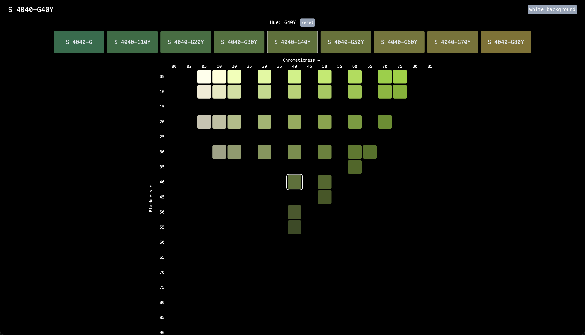
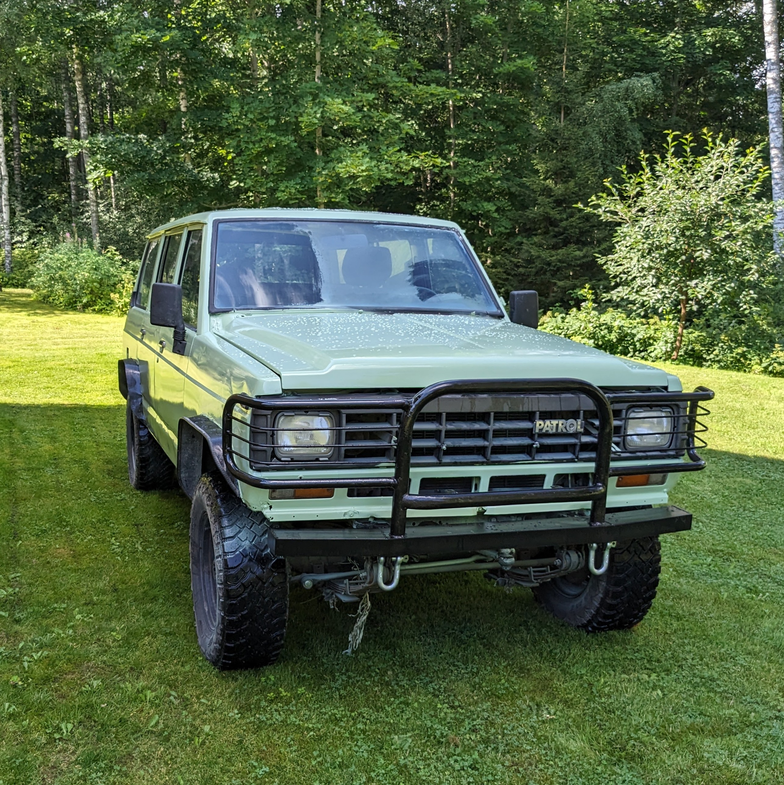

# NCS Color Picker

Simple color picker to compare different NCS colors.

> Disclaimer: Colors are converted to RGB for the browser and may differ from real NCS colors. Conversion values sourced from [NCS – RGB (Scandinavian Colour Institute)](https://colorysemiotica.wordpress.com/wp-content/uploads/2015/04/ncs-rgb.pdf) via [Color y Semiótica](https://colorysemiotica.wordpress.com).

Check the live version [here](https://veikkoaj.github.io/ncs-color-picker/).


Or run the development server locally:

```bash
npm install
npm run dev
```

Open [http://localhost:5173](http://localhost:5173) to view the site.



## Update

This was originally done back in 2024 when I was choosing a paint color for my Nissan Patrol offroader and I could not find a good NCS color comparing tool. 
In 2026 I updated it with the help of Claude Code when deciding a new color for my bicycle.

Ps. Here's a photo of the Patrol. The color I went with was `S 2020-G30Y` and the paint was Tikkurila Temadur 90.


